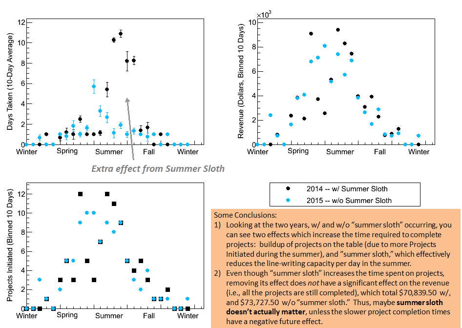

# summerSloth

Produces some fake data, representing coding projects done over a Year (250 business days), and then does a simple analysis of it.

To produce the data, simulateData() goes through each business day, and first determines how many projects came in that day according to a probability (pdf_projInit) which is sligtly Gaussian to represent more coming in the summer time.  Each project, an instance of the class Proj, is loaded (with loadProj()) into the vector belonging to the class Year.  The function loadProj() also statistically determines the length of the project being loaded.  1, 2, or 3 projects can come in, with decreasing probability.  Then, for that day, it goes though all existing projects, in order of initiation, and works on them if they have not been finished.  Each day is allotted a number of lines which can be written that day (lineStock), which is reduced in the summer time if "summer sloth" is allowed.  This effectively increases the time a project will take in the summer time, because people want to be outside instead. This is the effect which the analysis is supposed to reveal.  Revenue is determined as just a constant $500 plus $0.50 x lines required. 

outputAnalysis() loops through the Proj vector of specified Year and bins the average time taken for projects within each time bin (of 10 days), and also determines the standard error in each bin.  This loop also bins the revenue collected in each 10-day bin.  A second loop goes through each day and bins the number of projects initiated (from the array projInitPerDay of the Year) in 10-day bins.

I didn't write a plotter, I just have it output the analyzed data into a text file, one for w/ and one for w/o "summer sloth."  But I include plots with some conclusions:

